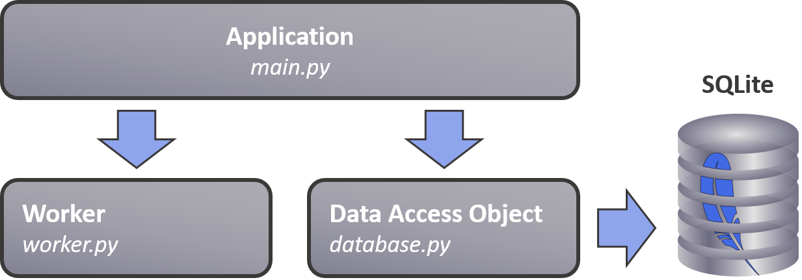

# pytesting - example application

[https://github.com/4OH4/pytesting](https://github.com/4OH4/pytesting)

This folder contains a skeleton Python application, as example target code for unit testing with Pytest.

As well as the application main code, it contains a worker module and a Data Access Object (DAO) that provides a layer of abstraction above a SQLite database:

The code doesn't really do much except read in data and communicate it to the database. Some parts of the code are deliberately light on input validation, to demonstrate how testing can identify unintended behaviours.